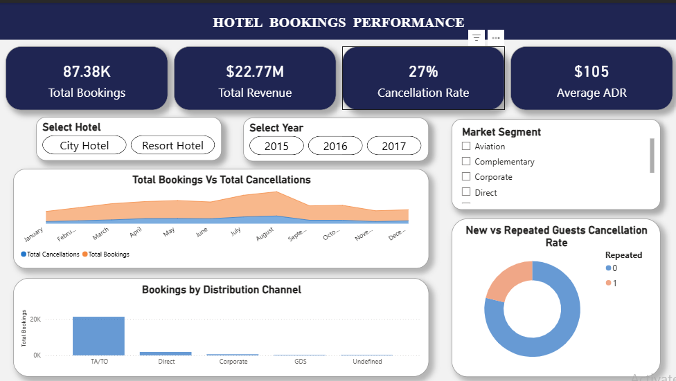

# 🏨 Hotel Bookings Performance & Optimization Dashboard

## 📌 Project Overview
This repository contains data analytics project designed to optimize hotel operations, evaluate cancellation risks, and maximize revenue realization. By combining raw data processing in MySQL with an interactive executive dashboard in Power BI, this project bridges the gap between raw backend data and strategic business intelligence.



---

## 📊 Key Performance Indicators (KPIs) & Strategic Value
The dashboard translates the **Task 1 and Task 2 datasets** into four foundational business metrics, built using robust DAX measures:

* **Total Realized Revenue ($22.77M)**
  * *Formula (DAX):* `SUM(HotelData[revenue])` *(Calculated strictly for non-canceled bookings)*
  * *Business Importance:* This represents actual cash in the bank, stripping away the "fake volume" of unfulfilled reservations to give stakeholders a realistic view of financial performance.
* **Total Bookings (87.38K)**
  * *Formula (DAX):* `COUNTROWS(HotelData)`
  * *Business Importance:* The baseline measure of market demand, indicating the success of top-of-funnel marketing campaigns and overall brand interest.
* **Overall Cancellation Rate (27%)**
  * *Formula (DAX):* `DIVIDE(SUM(HotelData[is_canceled]), COUNTROWS(HotelData), 0)`
  * *Business Importance:* A critical operational risk metric. High cancellation percentages flag revenue volatility, helping management implement tactical overbooking and deposit policies.
* **Average Daily Rate ($105)**
  * *Formula (DAX):* `AVERAGE(HotelData[adr])`
  * *Business Importance:* The primary indicator of pricing power and market positioning, revealing how much value guests place on accommodation per night.

---

## 🔍 SQL Deep Dive Analysis
Before building the visual layer, a thorough backend analysis was conducted in MySQL to extract granular insights:
* Developed deep dive queries investigating cancellation distribution across market segments, year-over-year seasonality trends, and booking lead-time risks.

---

## 🛠️ Technical Stack & Skills Demonstrated
* **Database Management:** MySQL (Data Cleaning, Aggregations, DDL/DML Scripting)
* **BI Tool:** Power BI Desktop (Data Modeling, DAX, Custom Themes, Layer Transparency)
* **UX/UI Design:** Created an executive-level interface utilizing container card layouts, customized button slicers, dual-axis combo charts, and overlay area shading.

---

## 📂 Repository Structure
```text
📂 hotel-bookings-analysis
 ┃
 ┣ 📜 README.md                         <-- Project documentation & business insights
 ┣ 📜 deep_dive_analysis.sql            <-- MySQL data cleaning & exploratory queries
 ┣ 📊 dashboard.pbix                    <-- Interactive Power BI portfolio file
 ┣ 🖼️ dashboardImage.png                <-- High-resolution dashboard image for GitHub
 ┣ 📄 cleaned_hotel_bookings.csv        <-- Core dataset compiled from Task 1 & Task 2

